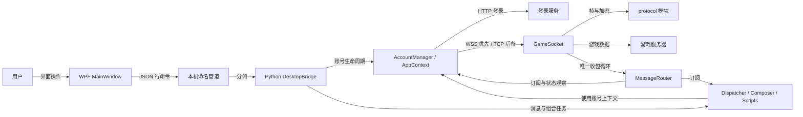

# 奥拉星长连接客户端：架构总览

> 范围：本仓库的 WPF 桌面程序、Python 后端、CLI 入口及复用的网络/协议模块。
> 核对时间：2026-09-27；依据当前工作区源码与构建配置。本页描述代码关系，不代表实际游戏连接已验证。
> 读者：需要定位功能、修改接口和长期维护此项目的开发者。

## 从哪里开始

本项目有两个主要进程：WPF 展示界面并经本机命名管道发命令；Python 后端管理账号、脚本、任务和游戏连接。一个在线账号对应一个 `AppContext`，其中的 `MessageRouter` 独占收包循环，`GameSocket` 负责实际收发和协议封包。对应入口分别是 `csharp/AolaLoader/MainWindow.xaml.cs::Window_Loaded`、`csharp/AolaLoader/BackendBridge.cs::StartAsync`、`src/ipc/server.py::DesktopBridge`、`src/accounts/session.py::open_context`。

箭头表示调用或数据传递，不代表每个模块都依赖图中的所有节点。更精确的消息格式与接口见[接口与依赖](docs/architecture/interfaces.md)，端到端调用见[运行流程](docs/architecture/flows.md)。

## 进程与入口

| 运行单元 | 入口及职责 | 依据 |
|---|---|---|
| WPF 桌面程序 | `App.xaml` 创建窗口；`MainWindow` 收集输入、显示状态；`BackendBridge` 启动 Python 子进程并维护管道 | `csharp/AolaLoader/App.xaml`、`csharp/AolaLoader/MainWindow.xaml.cs::Window_Loaded`、`csharp/AolaLoader/BackendBridge.cs::StartBackend` |
| Python 桥接后端 | 打包时从 `backend_main.py` 进入；源码运行时由 WPF 启动 `python -m src.ipc.server`；`DesktopBridge` 持有账号、脚本、消息和后台任务 | `backend_main.py`、`aola_backend.spec::Analysis`、`csharp/AolaLoader/BackendBridge.cs::StartBackend`、`src/ipc/server.py::DesktopBridge.__init__` |
| 命令行入口 | `cli_main.py` 调用 `src.app.main`，复用账号、发送和脚本模块 | `cli_main.py`、`src/app.py::main` |
| 独立批处理工具 | `batch_send_template.py` 直接调用账号和发送模块；`create_roles_batch.py` 独立处理角色创建及配置写回，不由 WPF 的脚本发现器加载 | `batch_send_template.py::main`、`create_roles_batch.py::main`、`src/scripting/loader.py::discover_scripts` |

`build_wpf.ps1` 将 PyInstaller 后端和 .NET WPF 发布物放入 `dist/AolaLoader`。打包脚本通过 `aola_backend.spec` 显式列出四个专用脚本；脚本新增时需要同步检查此清单（`build_wpf.ps1`、`aola_backend.spec::Analysis`）。

## 模块所有权

| 部分 | 拥有的职责与状态 | 对外接口 | 主要依赖 |
|---|---|---|---|
| WPF 界面 | 选择账号、消息和组合步骤；将结果投影到界面 | `csharp/AolaLoader/MainWindow.xaml.cs::CommandAsync`、`csharp/AolaLoader/Models.cs` | `BackendBridge` |
| 桌面桥接 | 管道请求分派、任务互斥、账号配置保存、事件回传 | `src/ipc/server.py::DesktopBridge._dispatch`、`_emit` | accounts、messaging、scripting、named_pipe |
| 账号与登录 | 配置校验、HTTP 角色登录、区服选择、连接重试和清理 | `src/accounts/manager.py::AccountConnection`、`src/accounts/session.py::open_context` | login、network、protocol.operations |
| 账号运行上下文 | 单账号套接字、收包路由、战斗生命周期、会话时钟、房间状态 | `src/network/context.py::AppContext`、`MessageRouter.subscribe` | `GameSocket`、登录结果 |
| 游戏传输与协议 | WSS/TCP 传输、消息序号、AMF3、加解密、帧编解码 | `src/network/socket_client.py::GameSocket.send_xt_message`、`recv_message` | `src/protocol/*`、`src/config.py` |
| 通用消息 | `#send=` 解析、发送计划、战斗入口确认、账号级结果 | `src/messaging/parser.py::SendMessage`、`dispatcher.py::execute_messages` | `AppContext`、`GameSocket` |
| 专用脚本与组合 | 发现脚本、按步骤和轮次调度消息批次/脚本 | `src/scripting/loader.py::InteractionScript`、`composer.py::execute_combination` | messaging、`AppContext` |

依赖主要从入口和编排层指向账号、网络与协议；`src/protocol/operations.py` 为调用 `GameSocket` 的高层协议操作，属于跨层依赖，详见[接口与依赖](docs/architecture/interfaces.md#依赖方向与例外)。

## 典型调用链

1. **启动与连接**：窗口 `Window_Loaded` → `BackendBridge.StartAsync` → 管道 `connect` 请求 → `DesktopBridge._run_connection_action` → `AccountConnection.connect` → `open_context` → HTTP 登录、游戏长连接、`MessageRouter.start` 与异步玩家初始化。见[运行流程](docs/architecture/flows.md#启动与账号连接)。
2. **通用消息**：界面解析 `#send=` → `DesktopBridge._run_send` → `dispatch_to_accounts` → 每账号 `execute_messages` → `GameSocket.send_xt_message`；战斗消息另经 `_BattleExecutor` 等待入口就绪。见[运行流程](docs/architecture/flows.md#通用消息与战斗入口)。
3. **组合任务**：界面传入消息快照、脚本模块名、轮数和轮间隔 → `DesktopBridge._run_combination` → `execute_combination_for_accounts` → 每账号依步骤调用 `execute_messages` 或 `InteractionScript.run`。见[运行流程](docs/architecture/flows.md#组合任务与专用脚本)。
4. **账号配置**：界面提交账号表单 → `DesktopBridge._mutate_account` → `_save_connections` 写入 `config.json` → 重建 `AccountManager`。见[运行流程](docs/architecture/flows.md#账号配置写入)。

## 状态、边界与阅读索引

- **已由源码确认**：每个账号的 `MessageRouter` 有一个收包任务，给观察器和订阅者分发解码消息（`src/network/context.py::MessageRouter.start`、`_receive_loop`、`publish`）。同账号的套接字发送使用锁序列化，多个账号可并发执行（`src/network/socket_client.py::GameSocket.send_xt_message`、`src/messaging/dispatcher.py::dispatch_to_accounts`）。
- **已由源码确认**：管道请求的即时 `response` 仅确认命令已受理；长任务完成状态经 `task` 事件发出（`src/ipc/server.py::DesktopBridge._dispatch`、`_start_task`、`_watch_task`）。`SendResult.success` 对一般消息表示发送函数完成，不等于游戏服务器接受业务结果（`src/messaging/dispatcher.py::_execute_simple_plan`、`_BattleExecutor._send`）。
- **已由源码确认**：`build_wpf.ps1` 是保留的桌面构建脚本；`cli_main.py` 是保留的命令行启动入口。两者复用 Python 账号、消息和协议模块（`build_wpf.ps1`、`cli_main.py`、`src/app.py`）。
- **未知**：服务器对专用脚本的选择/重置命令何时最终生效、所有异常响应的业务含义，以及当前发布目录是否与正在运行的安装目录相同；需要匹配的收发记录和实际运行验证。静态代码不能证明这些结果。

继续阅读：[接口与依赖](docs/architecture/interfaces.md) · [运行流程](docs/architecture/flows.md) · [维护指南](docs/architecture/maintenance.md) · [循序学习教程](tutorial.md)。
